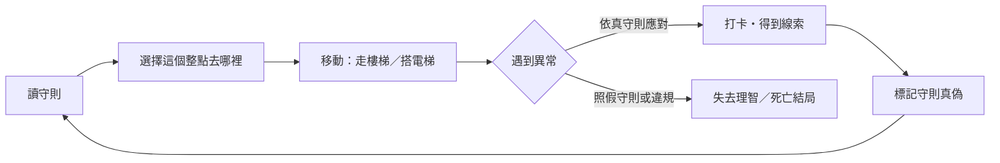

# 《夜巡守則》遊戲設計文件（GDD）

> 版本 1.0・類型：規則怪談 × 推理 × 資源管理・平台：網頁（桌面／手機）・遊玩時間：20–30 分鐘

---

## 1. 一句話概念

**你是新來的夜班保全，手上只有一本守則。三個晚上，守則一直在變；你得分辨哪幾條是真的，才能活到早上，也許還能救回上一個保全。**

## 2. 設計支柱

| 支柱 | 意思 | 在遊戲裡怎麼做 |
| --- | --- | --- |
| **守則既是盾牌，也是陷阱** | 規則怪談的核心張力：唯一能保護你的東西，本身也可能是假的。 | 第二夜起守則會被竄改，照著假守則做會死。 |
| **公平的推理** | 恐懼來自未知，挫折感則來自不公平。每條假守則都要能被看穿。 | 每條假守則至少有兩個獨立破綻（見第 6 節），並由驗證腳本強制檢查。 |
| **克制的恐怖** | 讓玩家自己想像，比 jump scare 更可怕。 | 純文字＋程序化音效；違規的後果多半只描寫一半。 |
| **短局、可重玩** | 一次 20–30 分鐘，死了可以從當晚重來，12 個結局鼓勵重玩。 | 每晚存檔點、結局收藏、死亡結局附提示。 |

## 3. 目標玩家

- 看過規則怪談、喜歡「找破綻」的讀者。
- 喜歡《8番出口》《I'm on Observation Duty》這類「照規則找異常」遊戲的玩家。
- 手機上零碎時間遊玩：每個決定都是一次點擊，隨時可以中斷。

## 4. 核心循環

- **微循環（每個整點）**：選地點 → 移動 → 事件 → 打卡。
- **中循環（每一夜）**：23:00–05:00 共 7 個決策點，要完成 5 個打卡點，03:00 必須回保全室（第五條），還要管理手電筒電量。
- **大循環（三夜）**：守則越來越不可信，線索越來越多，最後一夜決定要不要違反第三條，上七樓救人。

## 5. 系統設計

### 5.1 時間與地點

| 項目 | 數值 |
| --- | --- |
| 班表 | 22:00 開場、23:00–05:00 每整點一次決策、06:00 下班 |
| 地點 | 1F 保全室、B1 停車場、2F 牙醫診所、3F 補習班、5F 空辦公室、6F 機房（沒有 4F） |
| 打卡點 | B1、2F、3F、5F、6F（共 5 個） |
| 移動方式 | 走樓梯（會遇到樓梯間事件）、搭電梯（會遇到電梯事件） |

7 個決策點扣掉 03:00，剩 6 個可以用，要打 5 個卡，只有 **1 個小時的餘裕**。這讓每一次「被迫折返」（轉身下樓、逃回大廳）都有實際代價，玩家會開始權衡要不要冒險。

### 5.2 手電筒（4 格）

- 每次離開保全室用掉 1 格；在保全室待滿一個小時會換上新電池（包含 03:00）。
- 沒電時抵達樓層：找不到打卡鐘，理智 −15。
- 23:00–02:00 連續在外剛好用完 4 格，03:00 回保全室時補滿，這是設計好的節奏；額外的耗電事件會逼玩家用掉唯一的空檔。
- B1 的「免費電池」是誘惑：違反第八條可以立刻補滿，代價是理智 −15。

### 5.3 理智（0–100）

- 歸零即進入結局「新的住戶」。
- 每晚開始回復 25；在保全室休息一小時回復 10。
- 理智越低，畫面暗角越重、文字開始抖動、背景低頻與心跳聲越明顯（回饋玩家，也製造壓力）。
- **好奇心的價格**：「湊近看第十三個畫面」這類違規選項通常會失去理智，但能換到線索或劇情。這是刻意的風險／報酬設計。

### 5.4 守則與標記

- 守則面板隨時可開。第 1 頁、第 2 頁是公司印刷的（有公司章），第二頁背面是紅筆手寫的。
- 玩家可以在每條守則旁做記號（○ → ✓ 相信 → ✗ 不相信），這是給玩家自己推理用的筆記工具，遊戲不會評分。
- 「手機照片」：第一夜開場時拍下的守則，之後隨時可以切換對照，用來發現被竄改的條文。

### 5.5 線索

| 線索 | 取得方式 | 揭露的規則 |
| --- | --- | --- |
| c1 打卡鐘裡的紙條 | 第一夜 6F，選「打開來看」 | 老陳的紅筆字署名「陳」（耳東陳），其他都是假的 |
| c2 車上的筆記本 | 第二夜 B1，選「翻開筆記本」 | 公司章是正的，章反過來的那頁是假的 |
| c3 第十三個畫面 | 第二夜保全室，選「看清楚紙上寫什麼」（理智 −15） | 「五點」「影子」 |
| c4 隔板上的紅字 | 第三夜 5F，或第三夜監視器 | 上七樓的方法：一直照著自己的影子 |
| c5 白板角落 | 第二夜 3F | 它最會模仿主任的聲音 |

## 6. 守則真偽表與破綻設計

| # | 內容摘要 | 出現 | 外觀 | 真偽 | 破綻 |
| --- | --- | --- | --- | --- | --- |
| 1 | 上下班簽名 | 一～三 | 印刷・正章 | 真 | — |
| 2 | 沒有 4 樓，電梯在 4 樓開門不要出去 | 一～三 | 印刷・正章 | 真 | — |
| 3 | 樓梯間看到其他樓層，轉身下樓 | 一～三 | 印刷・正章 | 真 | — |
| 4 | 完成五個打卡點 | 一～三 | 印刷・正章 | 真 | — |
| 5 | 03:00–04:00 留在保全室 | 一、二 | 印刷・正章 | 真 | — |
| 5′ | 03:00–04:00 去頂樓門外等 | 三 | 印刷・**反章** | **假** | ①反章（c2）②與手機照片不同 ③開場提示「第五條好像不一樣」④B1 三個主任在催你上頂樓 |
| 6 | 監視器 13 個畫面就關掉 | 一～三 | 印刷 | 真 | 第三夜這頁是反章，但條文沒改；玩家要對照照片，不能整頁否定 |
| 7 | 自稱住戶就說「明天早上管理室有人」 | 一～三 | 印刷 | 真 | 同上 |
| 8 | 不要用別處找到的電池 | 一～三 | 印刷 | 真 | 同上 |
| 頁尾 | 「第 8 條以後都不是公司寫的，請勿理會」 | 三 | 印刷・**反章** | **假** | 反章；且與 c1 矛盾 |
| 9 | 主任不會半夜打電話 | 二、三 | 紅筆・陳 | 真 | — |
| 10 | 樓梯看到 7F 就繼續往上 | 二、三 | 紅筆・**陣** | **假** | ①署名是「陣」（c1）②與第三條矛盾 |
| 11 | 日誌已有你的簽名就不要簽 | 三 | 紅筆・陳 | 真 | — |
| 12 | 有人叫你的名字一定要回答 | 三 | 紅筆・**陣** | **假** | ①署名是「陣」②c4「不管誰叫你，都不要照過去」 |
| 13 | 七樓有扇門，五點會開，來帶我回去 | 三 | 紅筆・陳 | 真 | 與第三條「衝突」，但兩條都是真的：一條保命，一條救人 |

**設計重點**

- **陳／陣**：兩個字只差「東」與「車」，在手寫體裡一眼看不出來，但只要知道要看，就一定看得到。這是全作最核心的「啊哈」時刻；第二夜 03:00 的敲門事件還讓冒牌老陳親口說出「耳車，陣」。
- **反章**：公司印章用 SVG 繪製，被偽造的那頁整個水平翻轉，章上的字是反的。
- **反章的那頁不全是假的**：第 6–8 條原封不動地被抄過去。玩家必須用手機照片逐條比對，而不是看到反章就整頁否定。這一層讓推理從「找到規律」升級成「驗證規律」。
- **第 3 條 vs 第 13 條**：真結局要求玩家**違反一條真守則**。公司寫的守則保護的是你，老陳寫的是求救。這呼應了規則怪談最迷人的問題：守則是寫給誰的？

`tools/validate.mjs` 會強制檢查：假的手寫守則署名必須是「陣」、真的必須是「陳」；假的印刷守則所在頁面印章必須是反的。

## 7. 三夜節奏

| 夜 | 主題 | 新元素 | 致命事件 | 目標情緒 |
| --- | --- | --- | --- | --- |
| 第一夜 | 學會守則 | 8 條印刷守則，全部是真的 | 03:00 開門 | 不安、好奇 |
| 第二夜 | 紅筆字 | 第 9、10 條（一真一假）、陳／陣 | 開門、接電話照做、樓梯上 7F、電梯走出 4F | 懷疑 |
| 第三夜 | 守則被改了 | 反章頁、第 11–13 條、手機照片對照 | 照假第五條上頂樓、回應叫名、上七樓時把光移開、下班簽名 | 恐懼 → 決斷 |

第一夜的事件除了「開門」以外都不會直接致死，讓玩家安全地學會「違規會付出代價」。第二夜開始，照假守則行動會直接死亡。

## 8. 事件總表

| 夜 | 觸發 | 事件 | 考驗 | 正確應對 |
| --- | --- | --- | --- | --- |
| 一 | 第一次待在保全室 | 第十三個畫面 | 第 6 條 | 關螢幕（看清楚可得劇情，理智 −15） |
| 一 | 第一次搭電梯 | 停在 4 樓 | 第 2 條 | 不動 |
| 一 | 00:00 後走樓梯上 5F/6F | 7F 標示 | 第 3 條 | 轉身下樓（會失去這小時的打卡） |
| 一 | 3F | 找媽媽的男孩 | 第 7 條 | 說固定台詞後離開 |
| 一 | B1 | 免費電池 | 第 8 條 | 不理 |
| 一 | 6F | 打卡鐘裡的紙條 | — | 打開（線索 c1） |
| 一 | 03:00 保全室 | 主任敲門 | 第 5 條 | 不開門 |
| 二 | 00:00 後待在保全室 | 主任來電 | 第 9 條 | 不接 |
| 二 | 第一次走樓梯上 3F 以上 | 7F＋紅字「繼續往上」 | 第 3 條 vs 第 10 條 | 轉身下樓 |
| 二 | 第一次搭電梯 | 4 樓招手的人 | 第 2 條 | 不動 |
| 二 | 2F | 穿睡衣的住戶 | 第 7 條 | 說固定台詞後離開 |
| 二 | B1 | 沒人的車 | — | 翻開筆記本（線索 c2） |
| 二 | 03:00 保全室 | 「老陳」敲門 | 第 5 條 | 不開門（可問他「陳怎麼寫」） |
| 三 | 第一次搭電梯 | 多出來的 7 號按鈕 | 第 2 條 | 不動 |
| 三 | 走樓梯上 5F/6F（05:00 除外） | 有人叫你的名字 | 第 3 條 vs 第 12 條 | 下樓、不回答 |
| 三 | 2F | 長得跟你一樣的人 | 第 7 條 | 說固定台詞後離開 |
| 三 | 03:00 | 去頂樓還是留在保全室 | 第 5 條 vs 第 5′ 條 | 留在保全室，不開門 |
| 三 | 05:00 選 7F | 七樓救援 | 第 13 條＋c4 | 照著影子、回答「耳東陳」、不回頭 |
| 三 | 06:00 | 日誌上已有你的簽名 | 第 11 條 | 不簽，直接離開 |

各樓層另有隨機氛圍描寫與 25% 機率的小驚嚇（理智 −3），讓重複造訪不會變成例行公事。

## 9. 結局（12 個）

| # | 結局 | 種類 | 條件 |
| --- | --- | --- | --- |
| 01 | 交班 | 真結局 | 第三夜 05:00 上七樓成功帶回老陳，06:00 不簽名離開 |
| 02 | 天亮了 | 普通結局 | 撐過三夜，06:00 不簽名離開，但沒有救回老陳 |
| 03 | 重複的簽名 | 壞結局 | 第三夜下班時在已有簽名的日誌上簽名 |
| 04 | 解僱 | 特殊結局 | 第一夜、第二夜都沒完成五個打卡點 |
| 05 | 新的住戶 | 壞結局 | 理智歸零 |
| 06 | 敲門聲 | 壞結局 | 03:00 開門 |
| 07 | 四樓 | 壞結局 | 第二、三夜在 4 樓走出電梯 |
| 08 | 七樓 | 壞結局 | 照第十條上 7F、時間不對時上 7F、沒電還摸黑上 7F |
| 09 | 主任的電話 | 壞結局 | 第二夜接電話並照指示上頂樓 |
| 10 | 第五條 | 壞結局 | 第三夜照假的第五條在頂樓門外等到 04:00 |
| 11 | 有人叫你 | 壞結局 | 第三夜回應叫你名字的聲音 |
| 12 | 沒有影子 | 壞結局 | 七樓走廊上把光照向聲音 |

每個死亡結局都附一行「提示」，指向玩家漏看的破綻（例如「第九條的署名，是哪一個字？」），把挫折轉成下一輪的動機。

「解僱」是刻意放的反諷結局：最安全的下場，卻也永遠看不到真相。

## 10. 介面與美術方向

- **畫面構成**：一張夜班保全的桌面。左邊是大樓剖面（監控台），中間是事件紀錄，右邊是護貝過的守則。手機版保留中間的事件紀錄，大樓與守則改成從下方滑出的抽屜。
- **色彩**：沒開燈的房間（冷藍黑）、螢幕的磷光灰、手電筒的暖黃（所有可互動元素）、泛黃的紙、紅筆與公司章的紅。紅色只用在遊戲世界裡本來就是紅的東西。
- **字體**：守則用明體（Cactus Classical Serif），像真的印刷品；敘事用 Noto Serif TC；老陳的紅筆字用手寫體（芫荽 Iansui）；時鐘與數據用等寬字。標題直排。
- **大樓剖面的小細節**：3F 和 5F 之間留了一層高度的空隙，電梯井旁邊有一個幾乎看不見的「4」。看過 7F 之後，剖面圖頂端會多出一層紅色虛線。

## 11. 音效

全部用 Web Audio API 即時合成，不需要任何音檔：

- 底噪：低通的棕噪音（空調）、60Hz 日光燈嗡嗡聲。
- 隨理智下降：底噪變亮、加入低頻持續音、理智低於 35 出現心跳。
- 事件音：敲門、舊式電話鈴、電梯叮聲、監視器雜訊、刮門聲、風聲、驚嚇和弦、翻頁聲、整點提示音。

## 12. 數值平衡參考

| 行為 | 理智 |
| --- | --- |
| 依真守則正確應對 | −0 ～ −8 |
| 好奇的違規（看清楚、問問題） | −8 ～ −20 |
| 嚴重違規但未致死 | −25 ～ −45 |
| 沒電抵達樓層 | −15 |
| 隨機小驚嚇 | −3 |
| 保全室休息一小時 | +10 |
| 每晚開始 | +25 |

全部正確應對的玩家，三夜結束時理智大約還有 60–80；一路好奇的玩家，大約會在第二夜末到第三夜理智歸零。

## 13. 開發與測試

- `js/content.js`：所有文字、守則、事件、結局。新增內容只需要改這個檔案。
- `js/game.js`：狀態機與畫面。
- `js/audio.js`：程序化音效。
- `node tools/validate.mjs`：檢查事件引用、結局是否都能觸發、線索是否都能取得，以及第 6 節的公平性規則。
- `node tests/playthrough.cjs`：Playwright 自動遊玩三條路線（開門死亡＋重來、真結局全程、照假第五條）。

## 14. 後續擴充方向

1. **第四夜（後日談）**：玩家成為「主任」，替新人寫守則，自己決定要寫真話還是假話。
2. **每週輪替的大樓**：同一套引擎換成醫院、動物園、便利商店的守則。
3. **異常觀察模式**：保全室監視器做成真正的畫面，加入《8番出口》式的找不同玩法。
4. **雙人模式**：一人看守則、一人看事件，只能用語音溝通。
